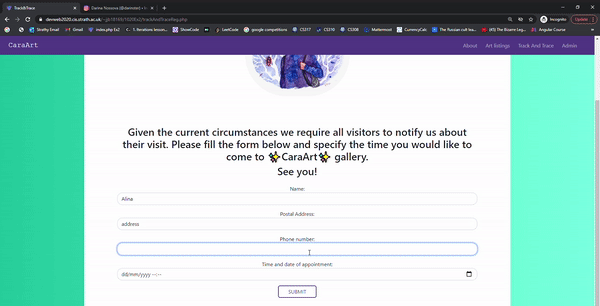

<h2>CaraArt :art: | CS312: Web Applications Development</h2>
 
A full web system to support Cara with handling painting orders. This website allows for displaying and ordering artwork.  
The website is hosted on devweb3000 (University Of Strathclyde web server for development work and student projects) and build using PHP, JS, HTML, MySql and bootstrap. Connection to the database will not be established unless CaraArt is hosted on devweb because the database password is stored there.
 
 
Note: This project is a submission for CS312: Web Applications Development

<h2>Visuals</h2>
All artwork is by Darina Nossova and is used with her permission. Insta: https://www.instagram.com/darinster/

